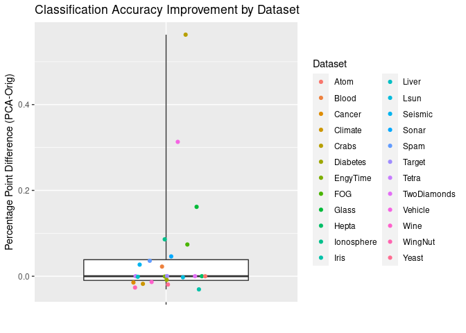
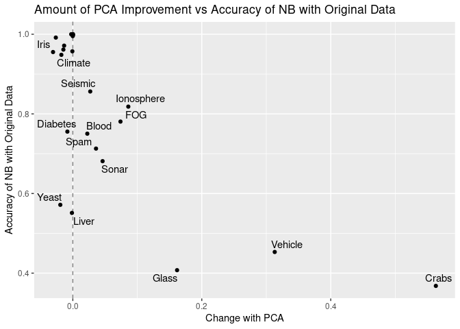
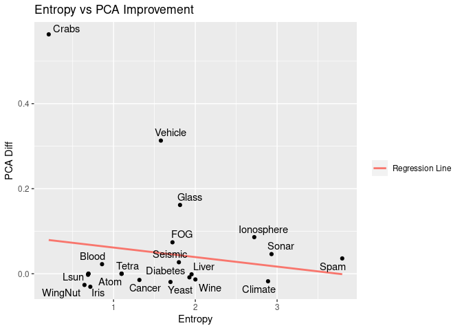
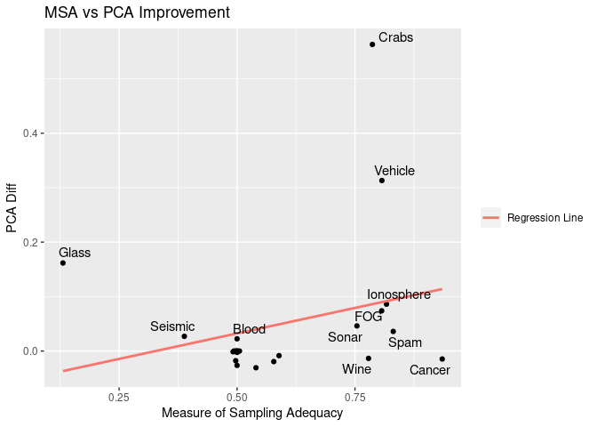

Examining the use of Principle Component Analysis for Naive Bayes
Classification
================
Daniel Farnand

    ## Error in solve.default(r) : 
    ##   Lapack routine dgesv: system is exactly singular: U[3,3] = 0
    ## # A tibble: 24 × 9
    ##    Orig              PCA     Diff  NFeatures NGroups NObs  Entropy KMO   dataset
    ##    <chr>             <chr>   <chr> <chr>     <chr>   <chr> <chr>   <chr> <chr>  
    ##  1 1                 1       0     3         7       212   1.0980… 0.49… Hepta  
    ##  2 1                 0.9975  -0.0… 2         3       400   0.6883… 0.5   Lsun   
    ##  3 1                 1       0     3         4       400   1.0982… 0.50… Tetra  
    ##  4 0.995375          0.99525 -0.0… 3         2       800   1.0980… 0.49… Atom   
    ##  5 0.957177734375    0.9564… -0.0… 2         2       4096  0.6911… 0.5   EngyTi…
    ##  6 0.997662337662338 0.9979… 0.00… 2         6       770   0.6930… 0.5   Target 
    ##  7 1                 1       0     2         2       800   0.6931… 0.5   TwoDia…
    ##  8 0.991633858267717 0.9652… -0.0… 2         2       1016  0.6443… 0.5   WingNut
    ##  9 0.368             0.931   0.563 5         4       200   0.2073… 0.78… Crabs  
    ## 10 0.955333333333333 0.9246… -0.0… 4         3       150   0.7158… 0.54… Iris   
    ## 11 0.971348314606741 0.9578… -0.0… 13        3       178   2.0005… 0.77… Wine   
    ## 12 0.712845033688329 0.7488… 0.03… 57        2       4601  3.7964… 0.83… Spam   
    ## 13 0.948333333333333 0.9305… -0.0… 18        2       540   2.8891… 0.49… Climate
    ## 14 0.750267379679144 0.7727… 0.02… 4         2       748   0.8592… 0.5   Blood  
    ## 15 0.551295336787565 0.5499… -0.0… 10        2       579   1.9539… 0.49… Liver  
    ## 16 0.780668083454506 0.8545… 0.07… 10        3       1519… 1.7205… 0.80… FOG    
    ## 17 0.856269349845201 0.8832… 0.02… 11        2       2584  1.7989… 0.38… Seismic
    ## 18 0.407476635514019 0.5691… 0.16… 9         6       214   1.8130… 0.13… Glass  
    ## 19 0.961493411420205 0.9468… -0.0… 9         2       683   1.3161… 0.93… Cancer 
    ## 20 0.68125           0.7274… 0.04… 60        2       208   2.9317… 0.75… Sonar  
    ## 21 0.75546875        0.7470… -0.0… 8         2       768   1.9276… 0.58… Diabet…
    ## 22 0.818233618233618 0.9042… 0.08… 32        2       351   2.7209… 0.81… Ionosp…
    ## 23 0.453191489361702 0.7663… 0.31… 18        4       846   1.5785… 0.80… Vehicle
    ## 24 0.571630727762803 0.5522… -0.0… 6         10      1484  1.6962… 0.57… Yeast

# Introduction

**Naive Bayes (NB) Classification** is an approach frequently used on a
variety of classification problems. By assuming independence of each of
the features (conditional on class), the overall conditional probability
of features given class membership can be simplified to the product of
individual univariate probabilities. Although real data can seldom be
considered to be truly independent, the assumption allows an efficient
approximation of the true multivariate density that often yields
surprisingly accurate results. s

**Principle Component Analysis (PCA)** is a type of data transformation
for multivariate data that “rotates” the axes to maximize the variance
shown on each successive dimension. The provides an alternative feature
space where the features are ordered by decreasing variance. This can be
used for reducing dimensionality of data by keeping a limited number of
components, and in general PCA has a variety of applications in data
modeling, analysis, and visualization. Its also also been shown to
increase the accuracy of Naïve Bayes Classification with specific
datasets[^1].

This claim leads us to the central question of this study. If PCA really
provides a substantial improvement to NB, then it should be recommended
in every case. However it is not clear how consistent the effect is
across different datasets, nor how much improvement in the
classification accuracy can really be expected. This paper discusses
what is currently known about Principal Component Analysis with Naive
Bayes Classification and shows the preliminary results of a study using
a varety of classification datasets. Impressions from the results of
this study can inform more in-depth research.

# Naive Bayes Classification

Naive Bayes is an application of Bayes’ Theorem to data classification
where Event A is defined as a given point’s label (or group membership),
while Event B is the set of features that define any given point (so

where the data contains

features). Therefore each point has a conditional probability of group
membership:

 \text{ Where i=1,2,...,N for N observations}")

Application of Bayes’ formula will give the following equation:

 = \frac{P(X_{1_i},X_{2_i},...,X_{p_i}|A_i) P(A)}{P(X_{1_i},X_{2_i},...,X_{p_i})}")

The denominator is constant for any given data, but the prior
probabilities
")
and
")
must be estimated. The critical step (and what makes this Bayesian
classifier “naive”) is assuming that features are independent within
each class. Therefore we can simplify this conditional multivariate
probability as the product of univariate conditional probabilities:

 = \prod\limits_{k=1}^p P(X_k|A)")

Therefore the equation can be revised as:

 = \frac{\left(\prod\limits_{k=1}^p P(X_k|A) \right) P(A)}{P(X_{1_i},X_{2_i},...,X_{p_i})}")

For this analysis we used the implementation of NB in the `e1071` R
package. (Meyer)

## Principle Component Analysis

The use of principal component analysis allows multidimensional data to
be represented in fewer dimensions by prioritizing the variation
captured in each dimension. This is normally helpful to visualize data
(as we can easily display two or three dimensional data, but four or
more dimensions becomes more difficult), but it has also incidentally
been found to improve Naive Bayes Classification.

Principal components are linear combinations of features that maximize
the variance of the data at each level. Thus the first principle
component will always have the highest variation, the second will have
the second highest, and so on. By definition all principal components
will be orthogonal as well. In R the `princomp` function provides
principal component analysis.

The use of PCA in Naive Bayes has been explored in a few studies. Gupta
(2004) demonstrated this with optical character recognition datasets.
This study found that with small datasets (defined as having
observations numbered in the hundreds) using principle components
greatly increased the accuracy of the classification. When large
datasets (observations in the thousands) were used, such improvements
were not seen.Fan and Poh (2007) conducted a related analysis that
demonstrated various methods to increase Naive Bayes accuracy. Their
analysis showed slight improvements when using PCA across all datasets
tested.

## Choice of Data

In order to best observe the performance of Naive Bayes in a variety of
conditions, datasets were chosen to display diverse characteristics,
including numbers of features, classes, and observations. Features
include discrete and continuous numerical data. All datasets also have a
finite and known set of mutually exclusive classes.

The following datasets were used. Specific details regarding the source
of data and implications of results are not discussed here as only the
details related to the comparative results of Naive Bayes with and
without PCA are considered relevant.

|                                                  |                |
|--------------------------------------------------|:---------------|
| **Dataset**                                      | **Citation**   |
| Fundamental Clustering Problems Suite            | Ultsch 2005    |
| Morphological Measurements on Leptograpsus Crabs | Cambell 1974   |
| Edgar Anderson’s Iris Data                       | Fisher 1936    |
| Wine recognition data                            | Forina         |
| Spam Email Database                              | Hopkins 1999   |
| Climate Model Simulation Crashes                 | Lucas          |
| Blood Transfusion Service Center                 | Yeh 2008       |
| Indian Liver Patients Dataset                    | Ramana 2012    |
| Daphnet Freezing of Gait Dataset                 | Bächlin 2010   |
| Seismic Bumps Dataset                            | Wrobel 2010    |
| Glass Identification Database                    | German 1987    |
| Wisconsin Breast Cancer Database                 | Wolberg        |
| Connectionist Bench (Sonar, Mines vs. Rocks)     | Gorman 1988    |
| Pima Indians Diabetes Data Set                   | Smith 1988     |
| Ionosphere Data Set                              | Sigillito 1989 |
| Vehicle Silhouettes                              | Siebert 1987   |
| Yeast Dataset                                    | Yeast          |

## Procedure

In order to process the datasets under standard conditions, R code was
written that calculated the Principle Components for a given dataset,
then tested both in 90/10 folding cross-validation, returning the
results as a array along with other details of the data and related
calculations. This information is tabulated as follows:

| Dataset     |  Orig |   PCA |   Diff | NFeatures | NGroups | NObs   | Entropy |   MSA |
|:------------|------:|------:|-------:|:----------|:--------|:-------|--------:|------:|
| Hepta       | 1.000 | 1.000 |  0.000 | 3         | 7       | 212    |   1.098 | 0.494 |
| Lsun        | 1.000 | 0.998 | -0.002 | 2         | 3       | 400    |   0.688 | 0.500 |
| Tetra       | 1.000 | 1.000 |  0.000 | 3         | 4       | 400    |   1.098 | 0.505 |
| Atom        | 0.995 | 0.995 |  0.000 | 3         | 2       | 800    |   1.098 | 0.496 |
| EngyTime    | 0.957 | 0.956 | -0.001 | 2         | 2       | 4096   |   0.691 | 0.500 |
| Target      | 0.998 | 0.998 |  0.000 | 2         | 6       | 770    |   0.693 | 0.500 |
| TwoDiamonds | 1.000 | 1.000 |  0.000 | 2         | 2       | 800    |   0.693 | 0.500 |
| WingNut     | 0.992 | 0.965 | -0.026 | 2         | 2       | 1016   |   0.644 | 0.500 |
| Crabs       | 0.368 | 0.931 |  0.563 | 5         | 4       | 200    |   0.207 | 0.787 |
| Iris        | 0.955 | 0.925 | -0.031 | 4         | 3       | 150    |   0.716 | 0.540 |
| Wine        | 0.971 | 0.958 | -0.013 | 13        | 3       | 178    |   2.001 | 0.779 |
| Spam        | 0.713 | 0.749 |  0.036 | 57        | 2       | 4601   |   3.796 | 0.831 |
| Climate     | 0.948 | 0.931 | -0.018 | 18        | 2       | 540    |   2.889 | 0.497 |
| Blood       | 0.750 | 0.773 |  0.022 | 4         | 2       | 748    |   0.859 | 0.500 |
| Liver       | 0.551 | 0.550 | -0.001 | 10        | 2       | 579    |   1.954 | 0.491 |
| FOG         | 0.781 | 0.855 |  0.074 | 10        | 3       | 151987 |   1.721 | 0.807 |
| Seismic     | 0.856 | 0.883 |  0.027 | 11        | 2       | 2584   |   1.799 | 0.388 |
| Glass       | 0.407 | 0.569 |  0.162 | 9         | 6       | 214    |   1.813 | 0.131 |
| Cancer      | 0.961 | 0.947 | -0.015 | 9         | 2       | 683    |   1.316 | 0.935 |
| Sonar       | 0.681 | 0.727 |  0.046 | 60        | 2       | 208    |   2.932 | 0.754 |
| Diabetes    | 0.755 | 0.747 | -0.008 | 8         | 2       | 768    |   1.928 | 0.589 |
| Ionosphere  | 0.818 | 0.904 |  0.086 | 32        | 2       | 351    |   2.721 | 0.817 |
| Vehicle     | 0.453 | 0.766 |  0.313 | 18        | 4       | 846    |   1.579 | 0.807 |
| Yeast       | 0.572 | 0.552 | -0.019 | 6         | 10      | 1484   |   1.696 | 0.578 |

## Discussion of Results

The first impression from the resulting data is that PCA does not lead
to a consistent change in the accuracy of Naive Bayes. The amount the
accuracy changed tends to be close to 0 (either positive or negative).
There are only three datasets for which we see significant improvement:
Crabs, Glass, and Vehicle.

<!-- -->

A pattern shown by this data is that for datasets in which Naive Bayes
does a very good job at classifying (over 90% correct in the
cross-validation), PCA tended not to perform as well. Other variation in
the results could be a result of the specific shape and nature of the
data. We can see this by looking at the plot of the results of the cross
validation of Naive Bayes with the original data versus the amount it
changed when the PCA procedure was introduced.

<!-- -->

One intuitive explanation of why PCA is very helpful in certain cases,
and not in others may be to think about the assumption that Naive Bayes
is built on, that each feature conditional on class membership is
independent of the others. Data that does not follow this assumption is
less likely to be accurately classified by the NB process. However one
of the results of PCA is that it removes the inter-correlation of the
variables. In these cases of highly correlated data results with PCA
could prove much more accurate. This is especially evident in the Crabs
dataset, for which PCA provided a very large improvement in accuracy. In
the opposite case, however, Naive Bayes classification of highly
*un*correlated data couldn’t improve beyond what had already been
accomplished with the original data, and moreso due to small alterations
that occur due to the PCA it might decrease.

In order to test this idea, we require a method to quantify the
inter-feature correlation conditional on each class. However finding a
single statistic that can be applied to such a variety of datasets for
comparison has proven difficult to
obtain.<!--# TODO: Look into a variant of box's test--> One proposed
method was to calculate the entropy of the correlation matrix’s
eigenvalues, however when plotted against the change in accuracy
associated with PCA, there was no correlation between entropy and
whether PCA caused a positive or negative change in test results.

<!-- -->

    ## 
    ## Call:
    ## lm(formula = Diff ~ Entropy, data = results_tab)
    ## 
    ## Residuals:
    ##      Min       1Q   Median       3Q      Max 
    ## -0.09858 -0.06822 -0.05092  0.02804  0.48370 
    ## 
    ## Coefficients:
    ##             Estimate Std. Error t value Pr(>|t|)
    ## (Intercept)  0.08395    0.05504   1.525    0.141
    ## Entropy     -0.02240    0.03132  -0.715    0.482
    ## 
    ## Residual standard error: 0.1336 on 22 degrees of freedom
    ## Multiple R-squared:  0.02273,    Adjusted R-squared:  -0.02169 
    ## F-statistic: 0.5118 on 1 and 22 DF,  p-value: 0.4819

We can see both visually and with the regression that there’s most
likely no relationship here.

Another option was the measure of sampling adequacy (MSA), used in
factor analysis.

<!-- -->

    ## 
    ## Call:
    ## lm(formula = Diff ~ KMO, data = results_tab)
    ## 
    ## Residuals:
    ##      Min       1Q   Median       3Q      Max 
    ## -0.12849 -0.05774 -0.03274 -0.01440  0.47688 
    ## 
    ## Coefficients:
    ##             Estimate Std. Error t value Pr(>|t|)
    ## (Intercept) -0.06128    0.09214  -0.665    0.513
    ## KMO          0.18732    0.14880   1.259    0.221
    ## 
    ## Residual standard error: 0.1306 on 22 degrees of freedom
    ## Multiple R-squared:  0.06719,    Adjusted R-squared:  0.02479 
    ## F-statistic: 1.585 on 1 and 22 DF,  p-value: 0.2213

We do see a correlation here, which may make this a good point to start
further investigations. Other measures from the area of signal
processing may provide a more adequate solution to this problem.

The Pima Diabetes and the Yeast datasets also stood out by going against
the trend, as results were not highly accurate with untransformed data,
but nonetheless displayed small drops in the accuracy when PCA is
applied. Further examination of this data might provide a better
understanding of the phenomenon in general.

## Conclusion

Based on the results of this exploration, Principle Components Analysis
would be recommended for classification problems that showed initially
poor results using the Naive Bayes Classifier. Therefore the
recommendation would always be to attempt NB on the original data first,
and then redo depending on the results. This type of trial and error
work is obviously not the sort of deterministic answer that could be
hoped for, so further work in understanding the interaction between PCA
and Naive Bayes and finding better ways to quantify the inter-feature
correlation within each class may provide a more concrete insight.

## References

Fan, Liwei, and Kim Leng Poh. “A Comparative Study of PCA, ICA and
Class-Conditional ICA for Naive Bayes Classifier.” In Computational and
Ambient Intelligence, 16–22. Springer, Berlin, Heidelberg, 2007.
<http://link.springer.com/chapter/10.1007/978-3-540-73007-1_3>.

Gupta, Gopal Krishna. “Principal Component Analysis and Bayesian
Classifier Based Character Recognition.” AIP Conference Proceedings 707,
no. 1 (April 21, 2004): 465–79. <doi:10.1063/1.1751388>.

Meyer, D., Dimitriadou, E., Hornik, K., Weingessel, A., Leisch, F.,
Chang, C., Lin, C., e1071 Library.

Weihs, C., Ligges, U., Luebke, K. and Raabe, N. (2005). klaR Analyzing
German Business Cycles. In Baier, D., Decker, R. and Schmidt-Thieme, L.
(eds.). Data Analysis and Decision Support, 335-343, Springer-Verlag,
Berlin.

## Dataset Citations

Lichman, M. (2013). UCI Machine Learning Repository
\[<http://archive.ics.uci.edu/ml>\]. Irvine, CA: University of
California, School of Information and Computer Science.

Ultsch, A. “Clustering with SOM: U\*C”, In Proc. Workshop on
Self-Organizing Maps, Paris, France, 2005, pp. 75-82

*The following datasets were obtained via the UCI Machine Learning
Repository.*

Bächlin, M., Plotnik, M., Roggen, D., Maidan, I., Hausdorff, J., M.,
Giladi, N.n and Tröster, G., “Wearable Assistant for Parkinson’s Disease
Patients With the Freezing of Gait Symptom.”” IEEE Transactions on
Information Technology in Biomedicine, 14(2), March 2010, pages 436-446

Campbell, N.A. and Mahon, R.J. A multivariate study of variation in two
species of rock crab of genus Leptograpsus. Australian Journal of
Zoology 22, 1974, 417–425.

Fisher, R. A.”The use of multiple measurements in taxonomic problems,”
1936, Annals of Eugenics, 7, Part II, 179–188, The data were collected
by Anderson, Edgar “The irises of the Gaspe Peninsula”, 1935, Bulletin
of the American Iris Society, 59, 2–5.

Forina, M. et al, “PARVUS - An Extendible Package for Data Exploration,
Classification and Correlation,” Institute of Pharmaceutical and Food
Analysis and Technologies, Via Brigata Salerno, 16147 Genoa, Italy. Data
colleted by Stefan Aeberhard, July 1991 Updated Sept 21, 1998 by
C.Blake.

German, B., “Glass Identification Database,” Central Research
Establishment Home Office Forensic Science Service Aldermaston, 1987,
Reading, Berkshire RG7 4PN

Gorman, R. P., and Sejnowski, T. J., “Analysis of Hidden Units in a
Layered Network Trained to Classify Sonar Targets,” 1988, in Neural
Networks, Vol. 1, pp. 75-89.

Hopkins, M., Reeber E., Forman, G., “Spam Email Database,” Jaap
Suermondt Hewlett-Packard Labs, 1999.

Lucas, D. D., Klein, R., Tannahill, J., Ivanova, D., Brandon, S.,
Domyancic, D., and Zhang, Y., “Failure analysis of parameter-induced
simulation crashes in climate models”, Geosci. Model Dev. Discuss., 6,
585-623,

Ramana, Bendi Venkata, Prof. M. S. Prasad Babu and Prof. N. B.
Venkateswarlu, A Critical Comparative Study of Liver Patients from USA
and INDIA: An Exploratory Analysis, International Journal of Computer
Science Issues, ISSN :1694-0784, May 2012.

Siebert, J.P., “Vehicle Recognition Using Rule Based Methods,” 1987,
Turing Institute Research Memorandum TIRM-87-018.

Sigillito, V. G., Wing, S. P., Hutton, L. V., & Baker, K. B,
“Classification of radar returns from the ionosphere using neural
networks,” 1989, Johns Hopkins APL Technical Digest, 10, 262-266.

Sikora M., Wrobel L.: Application of rule induction algorithms for
analysis of data collected by seismic hazard monitoring systems in coal
mines. Archives of Mining Sciences, 55(1), 2010, 91-114.

Smith, J.W., Everhart, J.E., Dickson, W.C., Knowler, W.C., & Johannes,
R.S., “Using the ADAP learning algorithm to forecast the onset of
diabetes mellitus,” 198, In Proceedings of the Symposium on Computer
Applications and Medical Care, IEEE Computer Society Press, pp. 261–265.

Wolberg, W.H., “Seismic Bumps Dataset,” 2010, General Surgery Dept.
University of Wisconsin, Clinical Sciences Center Madison, WI 53792.

“Yeast Dataset,” Kenta Nakai Institue of Molecular and Cellular Biology
Osaka, University 1-3 Yamada-oka, Suita 565 Japan.

Yeh, I-Cheng, Yang, King-Jang, and Ting, Tao-Ming, “Knowledge discovery
on RFM model using Bernoulli sequence,”Expert Systems with Applications,
2008 (<doi:10.1016/j.eswa.2008.07.018>).

[^1]: See further discussion of PCA and Gopal et al.
